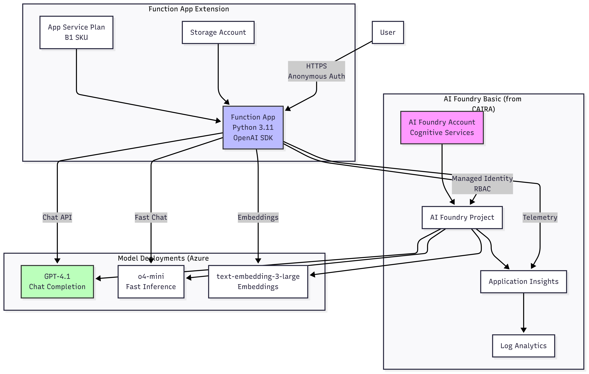
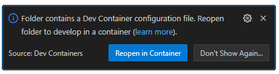

# AI Foundry Basic with Azure Function Integration - Implementation Guide

> **Educational Guide**: This implementation guide is designed for learning and experimentation. Some security features (like function authentication) are simplified for educational clarity. Production deployments should follow Azure security best practices.

## Overview

This guide extends the CAIRA `foundry_basic` reference architecture with Azure Functions to enable serverless compute capabilities integrated with Azure AI Foundry. The solution leverages the existing foundry_basic pattern and adds Azure Functions for serverless AI integration using Azure OpenAI services.

## Architecture Components



- **Azure AI Foundry**: Cognitive Services account for AI capabilities (via foundry_basic module)
- **Azure AI Project**: Organized workspace for AI workloads (via foundry_basic module)
- **Azure Function App**: Serverless compute with system-assigned managed identity
- **Application Insights**: Monitoring and diagnostics (via foundry_basic module)
- **Log Analytics**: Centralized logging (via foundry_basic module)

## Project Directory Structure

```plaintext
guides/implement_ai_foundry_basic_with_azure_function_integration/
├── function-app/                    # Azure Function application code
│   ├── function_app.py              # Main function implementation (uses OpenAI SDK)
│   ├── host.json                    # Function app global configuration
│   ├── local.settings.json          # Local development settings
│   └── requirements.txt             # Python dependencies
├── terraform/                       # Simplified Infrastructure as Code
│   ├── main.tf                      # Calls foundry_basic + adds function
│   ├── variables.tf                 # Input variables
│   ├── outputs.tf                   # Combined outputs
│   ├── providers.tf                 # Provider configuration
│   ├── function.tf                  # Azure Function resources
│   └── terraform.tfvars.example     # Example configuration
├── scripts/                         # Automation scripts
│   ├── deploy.sh                    # Single deployment script
│   └── configure-local-settings.sh  # Updated for AI Foundry
└── README.md                        # This guide
```

## Key Implementation Details

### Azure OpenAI Integration

The function app uses the **Azure OpenAI SDK** (not ML SDK) to connect to Cognitive Services:

- Uses `openai` Python library with Azure-specific authentication
- Connects directly to Cognitive Services endpoints
- Supports GPT-3.5, GPT-4, and other OpenAI models deployed in Azure

### Authentication Method

- **DefaultAzureCredential** for seamless authentication
- **System-assigned Managed Identity** in Azure
- Requires proper RBAC roles on Cognitive Services account

### Python Dependencies

```txt
azure-functions
azure-identity
openai>=1.0.0
azure-core
requests
```

## Prerequisites

### Required Tools

- [Azure CLI](https://learn.microsoft.com/en-us/cli/azure/install-azure-cli) (version 2.50+)
- [Terraform](https://developer.hashicorp.com/terraform) (version 1.13+)
- [Azure Functions Core Tools](https://learn.microsoft.com/en-us/azure/azure-functions/functions-run-local) (version 4.x)
- [Python](https://www.python.org/downloads/) (version 3.11+)

### Azure Requirements

- Active Azure subscription with sufficient permissions
- App Service Plan quota in target region (B1 tier or higher)
- Azure OpenAI service availability in your region

## Quick Start

### (Optional) VS Code Development Container

The recommended way to engage with this sample is through a [development container using VS Code](https://code.visualstudio.com/docs/devcontainers/containers):

1. Ensure that you have Docker configured. The easiest way is to install Docker Desktop locally, but see other options at the [Development Container documentation](https://code.visualstudio.com/docs/devcontainers/containers#_system-requirements).
1. Install [Visual Studio Code](https://code.visualstudio.com/).
1. Install the [Dev Containers extension](https://marketplace.visualstudio.com/items?itemName=ms-vscode-remote.remote-containers).
1. Clone the CAIRA repo using your method of choice.
1. Open the project in VS Code.
1. Assuming the Dev Containers extension is set up correctly, you should see a popup asking you if you would like to open the project in a dev container:

    

    Choose "Reopen in Container".
    - If you do not get the popup, you can instead click on the Dev Container extension in the bottom-left of the window, which will open a dropdown at the top of the window with a "Reopen in Container" option.

1. The first time you open the dev container, it will take a while to load and build all the configured settings. Once it has already been created, it will load more quickly in the future. In both cases there should be a notification that it is connecting, with an option to show logs; clicking on that notification will open a terminal showing all the configuration happening.

    

1. In the VS Code menu, click Terminal -> New Terminal to open a terminal within the container.
1. Install the Azure Functions Core Tools (will be needed for deploying the Azure Function):

   ``` bash
   sudo apt-get install azure-functions-core-tools-4
   ```

### 1. Clone and Setup

Navigate to this guide's directory:

```bash
cd guides/implement_ai_foundry_basic_with_azure_function_integration
```

### 2. Login to Azure

```bash
az login
az account set --subscription <your-subscription-id>

# Make subscription ID available to terraform providers as environment variable
export ARM_SUBSCRIPTION_ID=$(az account show --query id -o tsv)
```

### 3. Configure Variables

Create a `terraform.tfvars` file:

```bash
cd terraform
cat > terraform.tfvars <<EOF
location             = "swedencentral"
project_name         = "ai-functions"
project_display_name = "AI Functions Integration"
project_description  = "AI Foundry with Azure Functions for serverless AI"
function_app_sku     = "B1"
tags = {
  Environment = "dev"
  Project     = "AI-Functions"
}
EOF
```

## Complete Deployment Steps

### Step 1: Deploy Infrastructure

```bash
cd terraform
terraform init
terraform plan
terraform apply
```

This deploys:

- Cognitive Services account (AI Foundry)
- AI Project
- Function App with managed identity
- Storage account for Function App
- Application Insights and Log Analytics

### Step 2: Configure Managed Identity Permissions

The Function App's managed identity needs proper permissions to access Cognitive Services:

```bash
# Get the Function App's managed identity principal ID
FUNCTION_APP_NAME=$(terraform output -raw function_app_name)
RESOURCE_GROUP=$(terraform output -raw resource_group_name)
PRINCIPAL_ID=$(az functionapp identity show --name $FUNCTION_APP_NAME --resource-group $RESOURCE_GROUP --query principalId -o tsv)

# Get the Cognitive Services account name
COG_ACCOUNT_NAME=$(terraform output -raw ai_foundry_name)

# Grant required roles
az role assignment create \
  --assignee $PRINCIPAL_ID \
  --role "Cognitive Services User" \
  --scope /subscriptions/$(az account show --query id -o tsv)/resourceGroups/$RESOURCE_GROUP/providers/Microsoft.CognitiveServices/accounts/$COG_ACCOUNT_NAME

az role assignment create \
  --assignee $PRINCIPAL_ID \
  --role "Cognitive Services OpenAI User" \
  --scope /subscriptions/$(az account show --query id -o tsv)/resourceGroups/$RESOURCE_GROUP/providers/Microsoft.CognitiveServices/accounts/$COG_ACCOUNT_NAME

# For listing deployments, also grant Contributor role
az role assignment create \
  --assignee $PRINCIPAL_ID \
  --role "Cognitive Services Contributor" \
  --scope /subscriptions/$(az account show --query id -o tsv)/resourceGroups/$RESOURCE_GROUP/providers/Microsoft.CognitiveServices/accounts/$COG_ACCOUNT_NAME
```

### Step 3: Configure Function App Settings

```bash
# Set required environment variables
az functionapp config appsettings set \
  --name $FUNCTION_APP_NAME \
  --resource-group $RESOURCE_GROUP \
  --settings \
  AI_FOUNDRY_ENDPOINT="https://$COG_ACCOUNT_NAME.cognitiveservices.azure.com/" \
  AZURE_SUBSCRIPTION_ID="$(az account show --query id -o tsv)" \
  RESOURCE_GROUP="$RESOURCE_GROUP" \
  AI_FOUNDRY_PROJECT_NAME="$(terraform output -raw ai_foundry_project_name)" \
  AI_FOUNDRY_PROJECT_ID="$(terraform output -raw ai_foundry_id)"
```

### Step 4: Deploy Function Code

```bash
cd ../function-app

# Deploy using Azure Functions Core Tools
func azure functionapp publish $FUNCTION_APP_NAME --python --build remote
```

The `--build remote` flag ensures dependencies are built in Azure's environment, which is crucial for Python functions.

### Step 5: Deploy AI Models (Required for Chat Endpoint)

Before using the chat endpoint, you must deploy at least one model:

1. Go to [Azure AI Studio](https://ai.azure.com)
1. Select your project (e.g., "ai-functions")
1. Navigate to "Deployments" → "Deploy model"
1. Deploy a model such as:
   - GPT-3.5-turbo
   - GPT-4
   - GPT-4-turbo
1. Note the deployment name

Set the deployment as default (optional):

```bash
az functionapp config appsettings set \
  --name $FUNCTION_APP_NAME \
  --resource-group $RESOURCE_GROUP \
  --settings MODEL_DEPLOYMENT_NAME="your-deployment-name"
```

### Step 6: Verify Deployment

```bash
# Test health endpoint
curl $(terraform output -raw function_app_url)/api/health | jq .

# Expected response should show:
# - "status": "healthy"
# - "azure_openai": { "client_initialized": true }
# - "available_deployments": [list of deployed models]

# Test list-models endpoint
curl $(terraform output -raw function_app_url)/api/list-models | jq .
```

## Function Endpoints

### 1. Health Check (`/api/health`)

- **Method**: GET
- **Auth**: Anonymous
- **Purpose**: Verifies Function App and Azure OpenAI connectivity
- **Response**: JSON with configuration and connection status

### 2. List Models (`/api/list-models`)

- **Method**: GET
- **Auth**: Anonymous
- **Purpose**: Lists all deployed OpenAI models in the Cognitive Services account
- **Response**: JSON array of available deployments

### 3. Chat (`/api/chat`)

- **Method**: POST
- **Auth**: Function key required
- **Purpose**: Chat with deployed AI models
- **Request Body**:

  ```json
  {
    "prompt": "Your question here"
  }
  ```

- **Response**: AI-generated response with usage metrics

### 4. HttpExample (`/api/HttpExample`)

- **Method**: GET
- **Auth**: Anonymous
- **Purpose**: Basic connectivity test

## Testing the Deployed Functions

### Test Basic Connectivity

```bash
FUNCTION_URL=$(terraform output -raw function_app_url)
curl "$FUNCTION_URL/api/HttpExample?name=Azure"
```

### Test Health Check

```bash
curl "$FUNCTION_URL/api/health" | jq .
```

### Test Model Listing

```bash
curl "$FUNCTION_URL/api/list-models" | jq .
```

### Test Chat Endpoint (Requires Function Key)

```bash
# Get the function key
FUNCTION_KEY=$(az functionapp function keys list \
  --name $FUNCTION_APP_NAME \
  --resource-group $RESOURCE_GROUP \
  --function-name chat \
  --query "default" -o tsv)

# Test chat
curl -X POST "$FUNCTION_URL/api/chat" \
  -H "x-functions-key: $FUNCTION_KEY" \
  -H "Content-Type: application/json" \
  -d '{"prompt": "What is Azure Functions?"}' | jq .
```

## Local Development

### 1. Setup Python Environment

```bash
cd function-app
python3 -m venv .venv
source .venv/bin/activate  # On Windows: .venv\Scripts\activate
pip install -r requirements.txt
```

### 2. Configure Local Settings

```bash
cd ../scripts
./configure-local-settings.sh
```

Or manually create `function-app/local.settings.json`:

```json
{
  "IsEncrypted": false,
  "Values": {
    "AzureWebJobsStorage": "UseDevelopmentStorage=true",
    "FUNCTIONS_WORKER_RUNTIME": "python",
    "AI_FOUNDRY_ENDPOINT": "https://your-cog-account.cognitiveservices.azure.com/",
    "AI_FOUNDRY_PROJECT_NAME": "your-project-name",
    "AI_FOUNDRY_PROJECT_ID": "/subscriptions/.../providers/Microsoft.CognitiveServices/accounts/.../projects/...",
    "RESOURCE_GROUP": "your-rg",
    "AZURE_SUBSCRIPTION_ID": "your-subscription-id"
  }
}
```

### 3. Run Locally

```bash
cd function-app
func start
```

### 4. Test Locally

```bash
# Test health
curl http://localhost:7071/api/health | jq .

# Test chat (requires Azure authentication)
curl -X POST http://localhost:7071/api/chat \
  -H "Content-Type: application/json" \
  -d '{"prompt": "Hello from local development"}' | jq .
```

## Troubleshooting

### Common Issues and Solutions

#### 1. 404 Not Found on Function Endpoints

**Symptom**: `curl` returns 404 for all endpoints

**Solution**: Functions aren't deployed. Deploy the function code:

```bash
cd function-app
func azure functionapp publish $FUNCTION_APP_NAME --python --build remote
```

#### 2. Authorization Failed Errors

**Symptom**:

```plaintext
"AuthorizationFailed: The client '...' does not have authorization to perform action"
```

**Solution**: Grant managed identity permissions:

```bash
# Get principal ID
PRINCIPAL_ID=$(az functionapp identity show --name $FUNCTION_APP_NAME --resource-group $RESOURCE_GROUP --query principalId -o tsv)

# Grant Cognitive Services roles
az role assignment create --assignee $PRINCIPAL_ID --role "Cognitive Services User" --scope $(terraform output -raw ai_foundry_id)
az role assignment create --assignee $PRINCIPAL_ID --role "Cognitive Services OpenAI User" --scope $(terraform output -raw ai_foundry_id)
az role assignment create --assignee $PRINCIPAL_ID --role "Cognitive Services Contributor" --scope $(terraform output -raw ai_foundry_id)

# Restart Function App
az functionapp restart --name $FUNCTION_APP_NAME --resource-group $RESOURCE_GROUP
```

#### 3. ML Workspace Not Found

**Symptom**:

```plaintext
"ResourceNotFound: The Resource 'Microsoft.MachineLearningServices/workspaces/...' was not found"
```

**Solution**: The function app is using the wrong SDK. Ensure you're using the updated `function_app.py` that uses OpenAI SDK instead of ML SDK.

#### 4. No Models Available

**Symptom**: `list-models` returns empty array

**Solution**: Deploy models in Azure AI Studio:

1. Go to [Azure AI Studio](https://ai.azure.com)
1. Select your project
1. Deploy a model (GPT-3.5-turbo or GPT-4)

#### 5. Function Deployment Fails

**Symptom**: `func azure functionapp publish` fails

**Solutions**:

- Ensure you're logged in: `az login`
- Check correct subscription: `az account show`
- Verify Function App exists: `az functionapp list --resource-group $RESOURCE_GROUP`
- Use `--build remote` flag: `func azure functionapp publish $FUNCTION_APP_NAME --python --build remote`

#### 6. Local Development Authentication Issues

**Symptom**: DefaultAzureCredential fails locally

**Solution**: Login to Azure CLI:

```bash
az login
az account set --subscription <your-subscription-id>
```

### Debugging Commands

```bash
# Stream Function App logs
az webapp log tail --name $FUNCTION_APP_NAME --resource-group $RESOURCE_GROUP

# Check Function App configuration
az functionapp config appsettings list --name $FUNCTION_APP_NAME --resource-group $RESOURCE_GROUP --output table

# Verify managed identity
az functionapp identity show --name $FUNCTION_APP_NAME --resource-group $RESOURCE_GROUP

# List role assignments
PRINCIPAL_ID=$(az functionapp identity show --name $FUNCTION_APP_NAME --resource-group $RESOURCE_GROUP --query principalId -o tsv)
az role assignment list --assignee $PRINCIPAL_ID --output table

# Check deployed functions
az functionapp function list --name $FUNCTION_APP_NAME --resource-group $RESOURCE_GROUP --output table
```

## Monitoring

### Application Insights

```bash
# View recent logs
az monitor app-insights query \
  --app $(terraform output -raw application_insights_name) \
  --resource-group $RESOURCE_GROUP \
  --query "traces | take 20"
```

### Function Metrics

```bash
# View function invocations
az monitor metrics list \
  --resource $(az functionapp show --name $FUNCTION_APP_NAME --resource-group $RESOURCE_GROUP --query id -o tsv) \
  --metric "FunctionExecutionCount" \
  --interval PT1H
```

## Security Best Practices

### Managed Identity Configuration

- System-assigned managed identity with least-privilege RBAC roles
- No keys or secrets stored in code
- Uses DefaultAzureCredential for automatic authentication

### Network Security

- Consider implementing Private Endpoints for production
- Use IP restrictions on Function App if needed
- Enable CORS only for trusted domains

### Key Management

- Function keys for sensitive endpoints
- Rotate keys regularly
- Use Azure Key Vault for additional secrets

## Cost Optimization

- **Function App**:
  - Consumption plan: ~$0 for low usage
  - B1 App Service Plan: ~$55/month (better for consistent load)
- **Cognitive Services**:
  - Pay-per-token for OpenAI models
  - GPT-3.5-turbo: ~$0.0015 per 1K tokens
  - GPT-4: ~$0.03 per 1K tokens
- **Storage**: ~$5/month for Function App storage
- **Monitoring**: ~$5/month for Application Insights (low volume)

## Clean Up

Remove all resources:

```bash
cd terraform
terraform destroy -auto-approve

# Optional: Remove any role assignments
PRINCIPAL_ID=$(az functionapp identity show --name $FUNCTION_APP_NAME --resource-group $RESOURCE_GROUP --query principalId -o tsv 2>/dev/null)
if [ ! -z "$PRINCIPAL_ID" ]; then
  az role assignment delete --assignee $PRINCIPAL_ID
fi
```

## Known Limitations

- AI Foundry Projects is evolving; some features may change
- Model availability varies by region (check Azure OpenAI availability)
- Function consumption plan has cold start delays
- The foundry_basic module must be available in the relative path
- Azure OpenAI has rate limits and quotas per subscription

## Using GitHub Copilot for Implementation

When implementing this solution, GitHub Copilot can assist with code generation. Here are effective prompts:

### For Terraform Resources

```plaintext
# Prompt: "Create an Azure Cognitive Services account with OpenAI capabilities and system-assigned identity"
# Prompt: "Add a Function App with managed identity that can access Cognitive Services using RBAC"
# Prompt: "Generate Terraform outputs for Function App URL and Cognitive Services endpoint"
```

### For Python Functions

```plaintext
# Prompt: "Create an Azure Function that uses Azure OpenAI SDK with DefaultAzureCredential for managed identity authentication"
# Prompt: "Implement chat completion using Azure OpenAI with retry logic and error handling"
# Prompt: "Write a function to list OpenAI model deployments using Azure Management API"
```

### For Scripts

```plaintext
# Prompt: "Create a bash script that grants Cognitive Services roles to a Function App managed identity"
# Prompt: "Write a script to configure local.settings.json from Terraform outputs for Azure OpenAI endpoints"
# Prompt: "Generate deployment script that uses func azure functionapp publish with remote build"
```

## HVE (HyperVelocity Engineering) Prompts

For step-by-step guidance, use these Copilot prompts at each stage:

### Initial Setup

1. "How do I get the managed identity principal ID for my Function App?"
   - Copilot will guide you to use Azure CLI or Terraform outputs

1. "Generate Terraform code for Cognitive Services with OpenAI deployments"
   - Creates the necessary infrastructure for AI services

### Function Development

1. "Create a Python Azure Function that calls Azure OpenAI using managed identity authentication"
   - Ensures proper use of DefaultAzureCredential with OpenAI SDK

1. "Add comprehensive error handling for Azure OpenAI API calls with exponential backoff"
   - Implements production-ready resilience for rate limits

### Deployment & Configuration

1. "Generate Azure CLI commands to assign Cognitive Services roles to Function App managed identity"
   - Creates the necessary RBAC assignments

1. "Create a script to deploy function code with func azure functionapp publish and remote build"
   - Automates the deployment with proper Python dependency handling

### Testing & Debugging

1. "Generate curl commands to test Azure Function endpoints with function key authentication"
   - Creates test scenarios for all endpoints

1. "Write KQL queries for Application Insights to monitor OpenAI API usage and errors"
   - Sets up proper monitoring and diagnostics

### Troubleshooting

1. "How to fix 'AuthorizationFailed' errors when Function App calls Cognitive Services?"
   - Guides through RBAC role assignments

1. "Debug why deployed functions return 404 in Azure but work locally"
   - Helps verify deployment and configuration

## Support and Resources

- [Azure OpenAI Documentation](https://learn.microsoft.com/en-us/azure/ai-services/openai/)
- [Azure Functions Python Developer Guide](https://learn.microsoft.com/en-us/azure/azure-functions/functions-reference-python)
- [Azure AI Studio](https://ai.azure.com)
- [CAIRA Reference Architectures](../../reference_architectures/)

## Contributing

Please submit issues and pull requests for improvements to this guide. See the main [CAIRA Contributing Guide](../../CONTRIBUTING.md) for detailed information.
