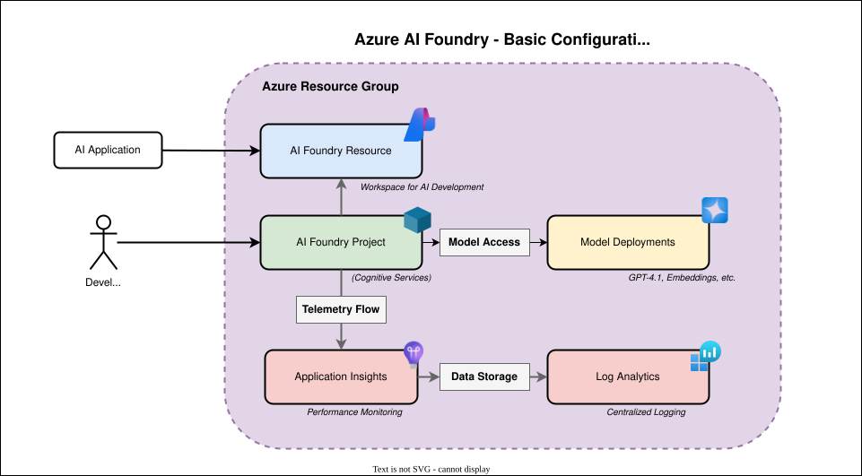

<!-- META
title: Azure AI Foundry - Basic Configuration
description: This Terraform configuration deploys a baseline Azure AI Foundry environment designed for development and experimentation with AI workloads.
author: CAIRA Team
ms.date: 08/14/2025
ms.topic: architecture
estimated_reading_time: 7
keywords:
   - reference architecture
   - azure ai foundry
   - basic configuration
   - terraform
   - application insights
   - log analytics
   - model deployments
-->

# Azure AI Foundry - Basic Configuration

This Terraform configuration deploys a baseline Azure AI Foundry environment designed for development and experimentation with AI workloads. It provides a simple, cost-effective setup that includes all essential components for building, testing, and monitoring AI applications.

## Overview

The Basic AI Foundry configuration creates a minimal but complete AI development environment suitable for:

- **Generative AI POC Development**: Building custom copilots, chatbots, and AI-powered applications
- **Model Experimentation**: Testing and fine-tuning AI models in a controlled environment
- **Learning and Training**: Educational environments for teams new to Azure AI services

## Architecture



### Components Deployed

| Component                   | Purpose                                  | Configuration                          |
|-----------------------------|------------------------------------------|----------------------------------------|
| **Resource Group**          | Container for all resources              | Conditionally created if not provided  |
| **AI Foundry Resource**     | Central AI platform (Cognitive Services) | Single Resource with model deployments |
| **AI Foundry Project**      | Workspace for organizing AI work         | One project with configurable settings |
| **Model Deployments**       | Pre-deployed AI models                   | GPT-4.1 by default (configurable)      |
| **Log Analytics Workspace** | Centralized logging and analytics        | 30-day retention, pay-per-GB           |
| **Application Insights**    | Application performance monitoring       | Linked to Log Analytics                |
| **Project Connection**      | Telemetry integration                    | Connects AI project to App Insights    |

## Key Features

- **🚀 Quick Setup**: Deploy in minutes with minimal configuration
- **💰 Cost-Optimized**: Uses standard pricing tiers suitable for development
- **📊 Observability**: Built-in monitoring and logging capabilities
- **🔧 Configurable**: Easily customizable through Terraform variables
- **📈 Scalable**: Foundation that can grow with your needs

## Getting Started

### Prerequisites

1. **Active Azure subscription(s) with appropriate permissions**
  It's recommended to deploy these templates through a deployment pipeline associated to a service principal or managed identity with sufficient permissions over the the workload subscription (such as Owner or Role Based Access Control Administrator and Contributor). If deployed manually, the permissions below should be sufficient.

   - **Workload Subscription**
     - **Role Based Access Control Administrator**: Needed over the resource group to create the relevant role assignments
     - **Network Contributor**: Needed over the resource group to create virtual network and Private Endpoint resources
     - **Azure AI Account Owner**: Needed to create a cognitive services account and project
     - **Owner or Role Based Access Administrator**: Needed to assign RBAC to the required resources (Cosmos DB, Azure AI Search, Storage)
     - **Azure AI User**: Needed to create and edit agents

1. **Register Resource Providers**

   ```shell
   az provider register --namespace 'Microsoft.CognitiveServices'
   ```

1. Sufficient quota for all resources in your target Azure region

1. Azure CLI installed and configured on your local workstation or deployment pipeline server

1. Terraform CLI version v1.13 or later on your local workstation or deployment pipeline server. This template requires the usage of both the AzureRm and AzApi Terraform providers.

### Basic Deployment

1. **Clone the repository**:

   ```shell
   git clone <repository-url>
   cd reference_architectures/foundry_basic
   ```

1. **Login to your Azure subscription**

    ```shell
    az login
    ```

1. **Set your active subscription**

    ```shell
    az account set --subscription "<your_subscription_id>"
    ```

1. **Export the subscription ID as an environment variable to make it available to the AzureRM and AzAPI Terraform providers**

    ```shell
    export ARM_SUBSCRIPTION_ID=$(az account show --query id -o tsv)
    ```

1. **Initialize Terraform**:

   ```shell
   terraform init
   ```

1. **Review the plan**:

   ```shell
   terraform plan
   ```

1. **Deploy the infrastructure**:

   ```shell
   terraform apply
   ```

## Usage Examples

### Accessing Your AI Foundry

After deployment, you can access your AI Foundry environment through:

1. **Azure Portal**: Navigate to your Cognitive Services account
1. **AI Foundry Studio**: Use the web interface for model management
1. **Azure CLI**: Interact programmatically with your deployments
1. **SDKs**: Connect from your applications using Azure AI SDKs

### Monitoring and Observability

The configuration includes built-in monitoring:

- **Application Insights**: View telemetry, performance metrics, and traces
- **Log Analytics**: Query logs and create custom dashboards

Access monitoring dashboards through the Azure Portal or create custom queries in Log Analytics.

## Cost Considerations

This configuration is designed to be cost-effective for development workloads:

- **AI Models**: Uses standard pricing tiers with minimal capacity
- **Storage**: Log Analytics with 30-day retention
- **Compute**: No dedicated compute resources (serverless model endpoints)

## Troubleshooting

### Common Issues

1. **Model Deployment Failures**:
   - Check model availability in your region
   - Verify quota limits for your subscription
   - Update model versions if outdated

1. **Permission Errors**:
   - Ensure your account has Contributor role on subscription/resource group
   - Check if Cognitive Services are available in your region

1. **Terraform Errors**:
   - Run `terraform validate` to check syntax
   - Update provider versions if needed
   - Check Azure CLI authentication with `az account show`

## Support

For issues and questions:

- Review the [troubleshooting guide](../../docs/troubleshooting.md)
- Check the [contributing guidelines](../../CONTRIBUTING.md)
- Open an issue in the repository

---

<!-- BEGIN_TF_DOCS -->
## Requirements

| Name      | Version        |
|-----------|----------------|
| terraform | >= 1.13, < 2.0 |
| azapi     | ~> 2.6         |
| azurerm   | ~> 4.40        |

## Providers

| Name    | Version |
|---------|---------|
| azurerm | ~> 4.40 |

## Modules

| Name                  | Source                                   | Version |
|-----------------------|------------------------------------------|---------|
| ai\_foundry           | ../../modules/ai_foundry                 | n/a     |
| application\_insights | Azure/avm-res-insights-component/azurerm | 0.2.0   |
| common\_models        | ../../modules/common_models              | n/a     |
| naming                | Azure/naming/azurerm                     | 0.4.2   |

## Resources

| Name                                                                                                                                            | Type     |
|-------------------------------------------------------------------------------------------------------------------------------------------------|----------|
| [azurerm_log_analytics_workspace.this](https://registry.terraform.io/providers/hashicorp/azurerm/latest/docs/resources/log_analytics_workspace) | resource |
| [azurerm_resource_group.this](https://registry.terraform.io/providers/hashicorp/azurerm/latest/docs/resources/resource_group)                   | resource |

## Inputs

| Name                          | Description                                                                                                                                                                                                 | Type          | Default                         | Required |
|-------------------------------|-------------------------------------------------------------------------------------------------------------------------------------------------------------------------------------------------------------|---------------|---------------------------------|:--------:|
| enable\_telemetry             | This variable controls whether or not telemetry is enabled for the module.<br/>For more information see <https://aka.ms/avm/telemetryinfo>.<br/>If it is set to false, then no telemetry will be collected. | `bool`        | `true`                          |    no    |
| location                      | Azure region where the resource should be deployed.                                                                                                                                                         | `string`      | `"swedencentral"`               |    no    |
| project\_description          | The description of the AI Foundry project                                                                                                                                                                   | `string`      | `"Default Project description"` |    no    |
| project\_display\_name        | The display name of the AI Foundry project                                                                                                                                                                  | `string`      | `"Default Project"`             |    no    |
| project\_name                 | The name of the AI Foundry project                                                                                                                                                                          | `string`      | `"default-project"`             |    no    |
| resource\_group\_resource\_id | The resource group resource id where the module resources will be deployed. If not provided, a new resource group will be created.                                                                          | `string`      | `null`                          |    no    |
| sku                           | The SKU for the AI Foundry resource. The default is 'S0'.                                                                                                                                                   | `string`      | `"S0"`                          |    no    |
| tags                          | (Optional) Tags to be applied to all resources.                                                                                                                                                             | `map(string)` | `null`                          |    no    |

## Outputs

| Name                                          | Description                                                                  |
|-----------------------------------------------|------------------------------------------------------------------------------|
| ai\_foundry\_id                               | The resource ID of the AI Foundry account.                                   |
| ai\_foundry\_model\_deployments\_ids          | The IDs of the AI Foundry model deployments.                                 |
| ai\_foundry\_name                             | The name of the AI Foundry account.                                          |
| ai\_foundry\_project\_id                      | The resource ID of the AI Foundry Project.                                   |
| ai\_foundry\_project\_identity\_principal\_id | The principal ID of the AI Foundry project system-assigned managed identity. |
| ai\_foundry\_project\_name                    | The name of the AI Foundry Project.                                          |
| application\_insights\_id                     | The resource ID of the Application Insights instance.                        |
| log\_analytics\_workspace\_id                 | The resource ID of the Log Analytics workspace.                              |
| resource\_group\_id                           | The resource ID of the resource group.                                       |
| resource\_group\_name                         | The name of the resource group.                                              |
<!-- END_TF_DOCS -->

## Catalog of Common Development Patterns and Variations

### Deployment Architecture Patterns

#### Pattern: Three-Tier AI Foundry Deployment

**Variations**:

- **Basic Tier Pattern**
  - Public networking configuration
  - Microsoft-managed resources
  - Portal-based deployment
  - Default security settings

- **Enterprise Tier Pattern**
  - Network isolation implementation
  - Bring Your Own Resource (BYOR) management
  - Infrastructure-as-Code deployment
  - Enhanced security configuration

- **Agent-Enabled Enterprise Pattern**
  - Full network isolation with agent service
  - Container apps environment integration
  - Subnet delegation requirements
  - Mandatory IaC implementation

#### Pattern: Capability Host Lifecycle Management

**Variations**:

- **Parent Capability Host Creation**
  - AI Foundry level implementation
  - Kind = "agents" configuration
  - Dependency ordering management

- **Child Capability Host Creation**
  - Project level implementation
  - Connection ID array management
  - Parent dependency validation

#### Pattern: Networking Configuration

**Variations**:

- **Basic Public Networking**
  - No custom VNet requirements
  - Default DNS configuration
  - Simplified subnet structure

- **Enterprise Private Networking**
  - Customer-provided VNet integration
  - Multiple subnet allocation (/27 agent, separate private endpoints)
  - Private DNS zone configuration
  - Subnet delegation to Microsoft.ContainerApps/environments

### Resource Provisioning Patterns

#### Pattern: Core AI Foundry Component Setup

**Variations**:

- **Minimal Configuration**
  - AI Foundry Account creation
  - Basic project setup
  - Default connections

- **Enterprise Configuration**
  - AI Search integration
  - Cosmos DB setup (RU provisioning)
  - Storage Account with RBAC
  - App Insights with Log Analytics

#### Pattern: Identity and Security Configuration

**Variations**:

- **System-Assigned Managed Identity**
  - Customer Managed Key encryption support
  - Standard RBAC configuration

- **User-Assigned Managed Identity**
  - Additional configuration complexity
  - Specific scope requirements

## Template Structures for Different Architecture Scenarios

Based on the three-tier deployment architecture defined in the CAIRA SME knowledge, each scenario requires specific components and configurations:

### Tier 1: Basic AI Foundry Template Structure

**Scenario Characteristics** (from document):

- Target Users: "Customers who trust Microsoft defaults"
- Complexity: "Low"
- Portal Support: "Full portal support available"

**Required Components**:

```yaml
Core_AI_Foundry_Components:
  - AI Foundry Account (Cognitive services account, kind: AI services)
  - AI Foundry Projects (with GUID and human-friendly name)
  - App Insights (required at AI Foundry resource level)
  - Shared Connections (at AI Foundry level preferred)

Networking_Configuration:
  - Type: Public networking
  - DNS: Default Azure DNS
  - Private Endpoints: None required

Identity_Configuration:
  - Managed Identity: System-assigned (standard configuration)

Deployment_Method:
  - Portal: Fully supported
  - IaC: Optional (terraform/bicep available)
  - Timeline: "30 minutes from terraform apply to operational instance"
```

### Tier 2: Enterprise AI Foundry Template Structure

**Scenario Characteristics**:

- Target Users: "Enterprise customers with security requirements"
- Approach: "Bring Your Own Resource (BYOR) management"
- Complexity: "High"
- Portal Support: "Limited - basic isolation possible through portal"

**Required Components**:

```yaml
Customer_Provided_Prerequisites:
  - Virtual Network (customer VNet - never create within CAIRA modules)
  - Subnets:
    - Private endpoint subnet (separate from other subnets)
  - AI Search (vector stores for agent functionality)
  - Cosmos DB (thread storage - optional, provision throughput or serverless)
  - Storage Account (file uploads and agent data)
  - App Insights (depends on Log Analytics workspace)
  - Private DNS Zones (multiple zones for different service endpoints)

AI_Foundry_Configuration:
  - All Basic tier components
  - Network isolation enabled
  - RBAC configuration across multiple resource scopes
  - Service principal requirements for specific scopes

Security_Configuration:
  - Customer Managed Key encryption (requires system-assigned managed identities)
  - RBAC vs local auth configuration for Storage Account

Deployment_Method:
  - Portal: Limited support for basic isolation
  - IaC: Recommended (terraform/bicep)
  - Prerequisites: Significant networking setup required
```

### Tier 3: Agent-Enabled Enterprise AI Foundry Template Structure

**Scenario Characteristics**:

- Target Users: "Enterprise customers requiring protected agents"
- Complexity: "Highest"
- Portal Support: "NONE - Infrastructure-as-Code mandatory"

**Required Components**:

```yaml
All_Enterprise_Prerequisites_Plus:
  - Container Apps Environment
  - Cosmos DB (REQUIRED for thread storage - not optional)
  - AI Search (REQUIRED for vector stores)

Agent_Specific_Networking:
  - Agent Subnet:
    - Minimum size: /27
    - Recommended size: /21 (production)
    - Delegation: Microsoft.ContainerApps/environments
    - Constraint: Cannot reuse for multiple AI Foundry instances
  - Private Endpoint Subnet (separate from agent subnet)
  - Multiple Private DNS Zones:
    - privatelink.cognitiveservices.azure.com
    - privatelink.openai.azure.com
    - privatelink.search.windows.net
    - privatelink.documents.azure.com
    - privatelink.blob.core.windows.net

Capability_Host_Configuration:
  - Parent Capability Host (AI Foundry level):
    - Kind: "agents" (required field)
    - Creation: IaC only (bicep/terraform)
    - Lifecycle: Cannot update in-place (destroy/recreate required)
  - Child Capability Hosts (Project level):
    - Connection IDs: Must pass as arrays
    - Dependency: Parent must exist first
    - Hierarchy: Strict ordering requirement

Regional_Constraints:
  - Class A Subnets: Limited regions, allowlisting required
    - Supported: West US, East US, East US 2, Central US, Japan East, France Central, Spain Central, UAE North
    - Contact: fosteramanda@microsoft.com for allowlisting
  - Class B/C Subnets: GA in all AI Foundry Agent Service regions

Deployment_Method:
  - Portal: NOT SUPPORTED
  - IaC: MANDATORY (bicep/terraform only)
  - Prerequisites: Container apps environment, subnet delegation
```

---

## Code Generation Decision Matrices

### Deployment Type Decision Matrix

| Customer Requirement   | Portal Possible | IaC Required  | Recommended Pattern      | Complexity |
|------------------------|-----------------|---------------|--------------------------|------------|
| Basic PoC/Development  | ✅ Yes           | ❌ No          | Basic Tier               | Low        |
| Network Isolation Only | ⚠️ Limited      | ✅ Yes         | Enterprise Tier          | Medium     |
| Protected Agents       | ❌ No            | ✅ Yes         | Agent-Enabled Enterprise | High       |
| Custom DNS             | ❌ No            | ✅ Yes         | Enterprise+              | High       |
| CMK Encryption         | ❌ No            | ✅ Yes         | Enterprise+              | Medium     |
| Multi-Project          | ✅ Yes           | ✅ Recommended | Any Tier                 | Low-High   |

### Resource Selection Decision Matrix

| Scenario              | AI Search | Cosmos DB | Storage RBAC | App Insights | Container Apps |
|-----------------------|-----------|-----------|--------------|--------------|----------------|
| Basic Development     | Optional  | Optional  | Local Auth   | Required     | Not Supported  |
| Enterprise w/o Agents | Required  | Optional  | RBAC         | Required     | Not Required   |
| Enterprise w/ Agents  | Required  | Required  | RBAC         | Required     | Required       |
| Multi-Region          | Required  | Required  | RBAC         | Required     | Per Region     |

### Networking Configuration Decision Matrix

| Network Requirement    | Subnet Count    | Subnet Sizes          | DNS Zones | Delegation Required       |
|------------------------|-----------------|-----------------------|-----------|---------------------------|
| Public Networking      | 0               | N/A                   | 0         | No                        |
| Private Endpoints Only | 1               | /28 minimum           | 5+        | No                        |
| Agent Service          | 2+              | /27 agent min, /28 PE | 5+        | Yes (ContainerApps)       |
| Multi-AI Foundry       | 2+ per instance | /21 agent recommended | Shared    | Yes (unique per instance) |

---

## Complexity Scoring for Automation Feasibility

### ICI Scoring Matrix

Based on Hohpe & Woolf's Enterprise Integration Patterns, the Integration Complexity Index (ICI) quantifies pattern complexity through integration points, data transformations, protocol transitions, and asynchronous operations.

**ICI Formula**: Integration Points + (Data Transformations × 2) + (Protocol Transitions × 2) + (Async Operations × 3)

| Pattern                      | Integration Points | Data Transforms | Protocol Transitions | Async Operations | ICI Score | Automation Feasibility |
|------------------------------|--------------------|-----------------|----------------------|------------------|-----------|------------------------|
| Basic AI Foundry Setup       | 2                  | 0               | 0                    | 0                | **2**     | Full Automation        |
| Multi-Project Setup          | 3                  | 1               | 0                    | 0                | **5**     | Full Automation        |
| RBAC Configuration           | 5                  | 1               | 0                    | 1                | **10**    | High Automation        |
| CMK Encryption               | 4                  | 2               | 1                    | 1                | **13**    | Semi-Automation        |
| Enterprise Network Isolation | 6                  | 2               | 3                    | 1                | **19**    | Semi-Automation        |
| Capability Host Lifecycle    | 6                  | 3               | 2                    | 2                | **22**    | Guided Assistance      |
| Agent Service Configuration  | 9                  | 4               | 5                    | 3                | **36**    | Expert Guidance        |

**Automation Feasibility Thresholds**:

- **Full Automation** (ICI 0-5): Direct template deployment, no user intervention
- **High Automation** (ICI 6-12): Template with validation checkpoints
- **Semi-Automation** (ICI 13-20): Multi-stage with user confirmation gates
- **Guided Assistance** (ICI 21-30): Step-by-step manual execution with guidance
- **Expert Guidance** (ICI 31+): Complex manual implementation with expert support

### Key Complexity Drivers

**Integration Points** (1x multiplier):

- Each external service or resource that must be connected
- Example: Agent Service requires 9 integrations (VNet, Subnets, Container Apps, Cosmos DB, AI Search, Storage, DNS, Capability Hosts, Projects)

**Data Transformations** (2x multiplier):

- Format changes, mappings, or conversions required
- Example: Connection IDs must be transformed to arrays for capability hosts

**Protocol Transitions** (2x multiplier):

- Changes in communication protocols or deployment methods
- Example: Portal → IaC mandatory for agent-enabled scenarios

**Async Operations** (3x multiplier):

- Operations requiring wait states or eventual consistency
- Example: Capability host destroy/recreate cycles, DNS propagation

### Automation Priority Recommendations

**Priority 1 - Immediate Automation** (ICI ≤ 12):

- Basic AI Foundry Setup (2)
- Multi-Project Setup (5)
- RBAC Configuration (10)

**Priority 2 - Phased Automation** (ICI 13-20):

- CMK Encryption (13)
- Enterprise Network Isolation (19)

**Priority 3 - Guided Implementation** (ICI > 20):

- Capability Host Lifecycle (22)
- Agent Service Configuration (36)

---

## Implementation Recommendations

### Copilot Instruction Generation Strategy

1. **Pattern Recognition Phase**
   - Analyze user requirements against decision matrices
   - Identify matching patterns from catalog
   - Select appropriate template structure

1. **Complexity Assessment Phase**
   - Calculate complexity score
   - Determine automation feasibility
   - Select appropriate Copilot strategy

1. **Code Generation Phase**
   - Apply selected template
   - Inject customer-specific variables

1. **Validation Phase**
   - Check dependency requirements
   - Validate networking constraints
   - Ensure security compliance

### Key Success Factors

- **Clear Scenario Separation**: Maintain distinct paths for basic vs enterprise implementations
- **Infrastructure Maturity Assessment**: Evaluate customer IaC readiness early
- **Networking Prerequisites**: Document and validate networking requirements upfront
- **Lifecycle Management**: Implement proper destroy/recreate patterns for capability hosts
- **Documentation Quality**: Address scattered PG documentation through consolidated guidance
